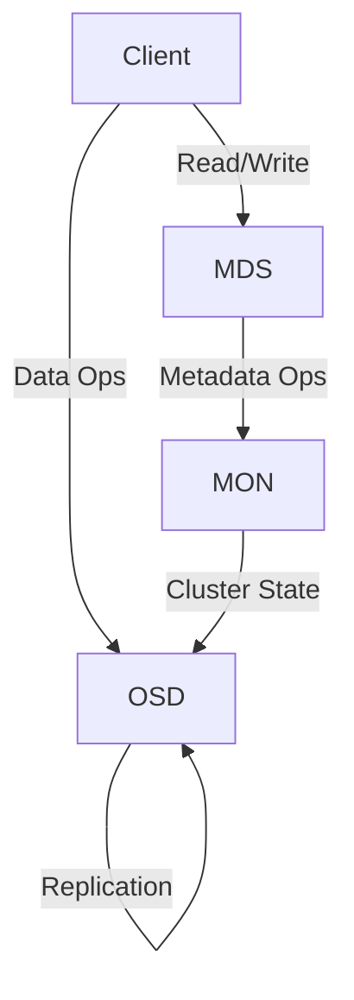

# Ceph Storage Cluster

## Overview

A Ceph Storage Cluster is a distributed storage system that provides high performance, reliability, and scalability. It aggregates storage resources from multiple nodes and presents them as a unified storage pool.

## Key Components

- **OSD (Object Storage Daemon):** Handles data storage, replication, recovery, and rebalancing.
- **MON (Monitor):** Maintains cluster state, including cluster map and authentication.
- **MDS (Metadata Server):** Manages metadata for CephFS (Ceph File System).

## Features

- **Scalability:** Easily add or remove nodes without downtime.
- **Fault Tolerance:** Data is replicated across nodes to prevent data loss.
- **Self-Healing:** Automatically detects and recovers from failures.

## Basic Architecture

## Use Cases

- Cloud storage backends
- High-performance computing
- Enterprise data storage

## References

- [Ceph Documentation](https://docs.ceph.com/en/latest/)