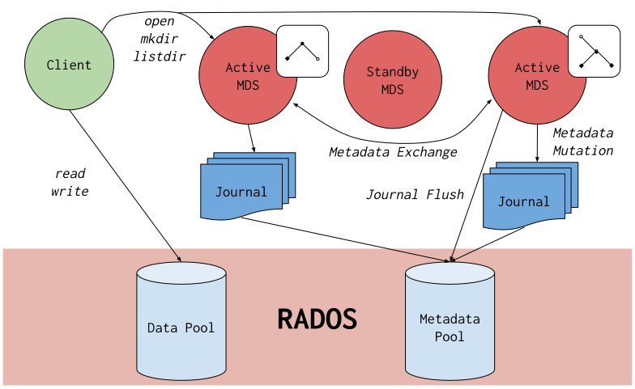

# Ceph

**Ceph** is an open-source, software-defined, distributed storage system that provides object, block, and file storage in a single, scalable, and resilient platform. It decouples data from hardware, allowing organizations to build highly available and durable storage clusters on commodity hardware.

Ceph uses the **CRUSH** algorithm to dynamically distribute data across storage nodes, enabling self-healing, self-rebalancing, and petabyte-scale operations.

## Key Components

- **RADOS** (Reliable Autonomic Distributed Object Store): The core foundation of Ceph, providing a distributed object store that manages data storage and retrieval. 
- **CRUSH Algorithm**: A sophisticated algorithm that calculates data placement across the cluster, eliminating the need for centralized metadata servers and enabling dynamic scaling and rebalancing. 
- Unified Storage: Ceph offers three primary storage interfaces, **Object Storage (RADOS Gateway)**, **Block Storage (RBD)**, and **File Storage (CephFS)**.

## Use Cases

- Cloud Storage: OpenStack, Kubernetes
- Backup & Archiving
- Big Data

