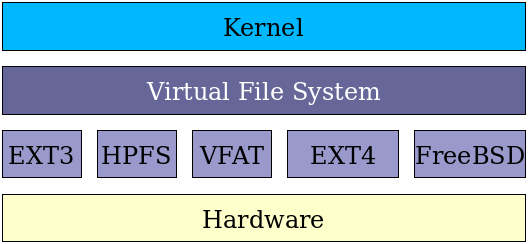

# FileSystems

File systems are a crucial part of any operating system, providing a structured way to store, organize, and manage data on storage devices such as hard drives, SSDs, and USB drives. Essentially, a file system **acts as a bridge between the operating system and the physical storage hardware**, allowing users and applications to create, read, update, and delete files in an organized and efficient manner. In computing, a file system -- sometimes written filesystem -- is a logical and physical system for organizing, managing and accessing the files and directories on a device's solid-state drive (SSD), hard-disk drive (HDD) or other media. Without a file system, the operating system (OS) would see only large chunks of data without any way to distinguish one file from the next. 

> We've seen a variety of data structures where the file could be kept. The file system's job is to keep the files organized in the best way possible.

The filesystem is the component of the OS that stores and retrieves information from the physical storage. You hand it files and it stores them. You ask for a file and it retrieves it. You edit a file and it overwrites the modified data. How it does that its mostly up to itself. The component that actually shows you the directory tree and you interact with is the **"Virtual File System" (VFS)**. That's how you can use multiple filesystems at the same time. The VFS organizes all the files from the all the mounted filesystems into a directory tree and then asks the underlying filesystem to read or write the actual files it needs.

## How it works?

A file system stores and organizes data. It can be thought of as a type of index for all the data contained in a storage device. In addition to SSDs and HDDs, file systems are used for optical disks, flash drives and magnetic tape. Along with a file's content data, a file system maintains metadata about the files along with other information. The metadata might include details such as the file size, creation date or location in the directory.

## Architecture

File systems handle both the physical and logical operations associated with managing files. Although they take different approaches to storing file data, they commonly separate metadata from the file's content data. They also store a small amount of other data types, which are used for maintaining the file system and facilitating file access.

Think of it like a library’s catalog system:

- The library building = the storage device
- The catalog = filesystem metadata (tables, indexes)
- Books on shelves = actual data blocks
- Rules for putting books in the right spot, naming them, and tracking them = filesystem format

A filesystem defines:

- How data is split into blocks
- How files are named
- How directories and subdirectories work
- How permissions are stored
- How free space is tracked
- How to recover from errors

Without a filesystem, the disk is just a sea of raw bytes — no structure.

## Types

- File Allocation Table (FAT)
- exFAT
- New Technology Filesystem (NTFS)
- Resilient File System (ReFS)
- Extended filesystem (ext)
- B-tree filesystem (Btrfs)
- Global File System (GFS)
- Hierarchical file system (HFS)
- HDFS
- NFS
